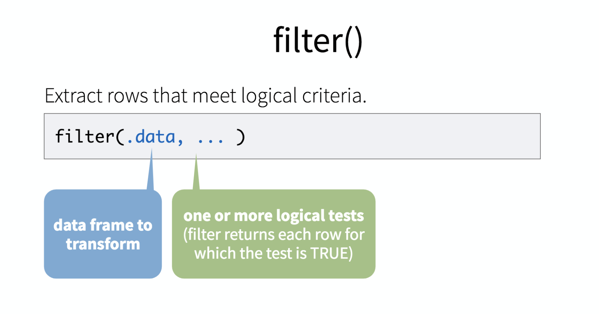
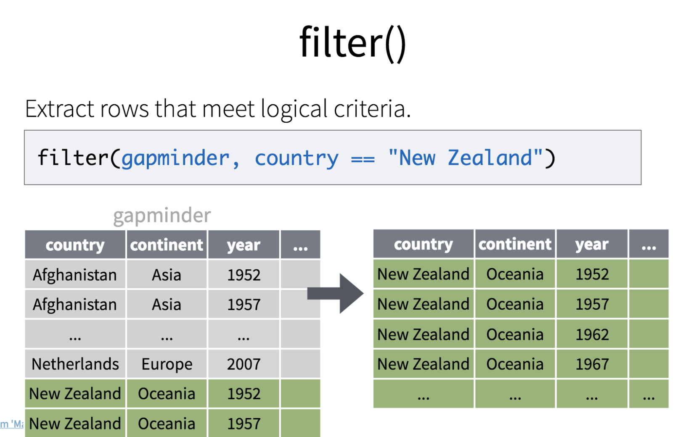
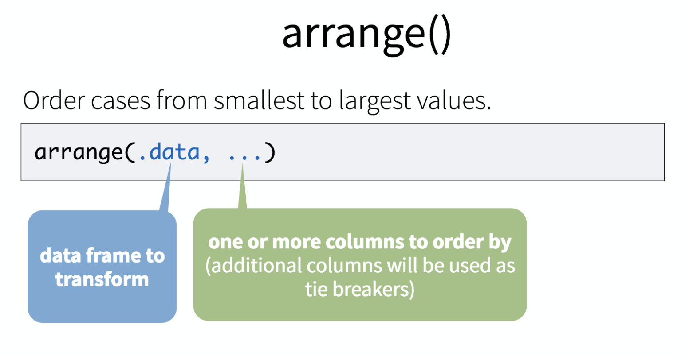
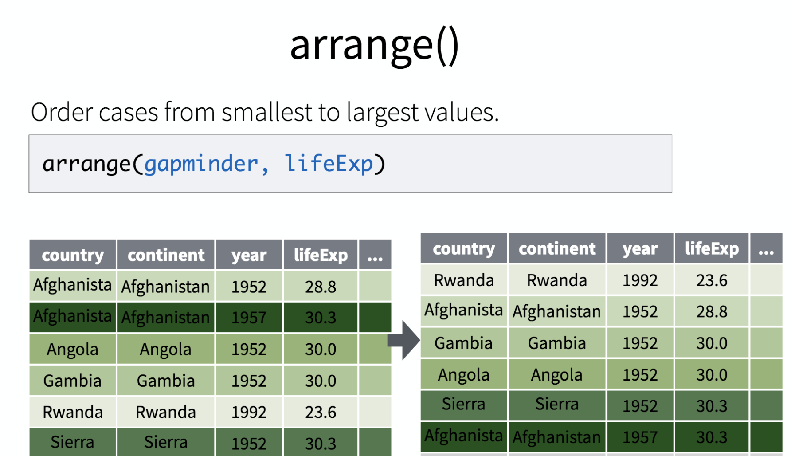
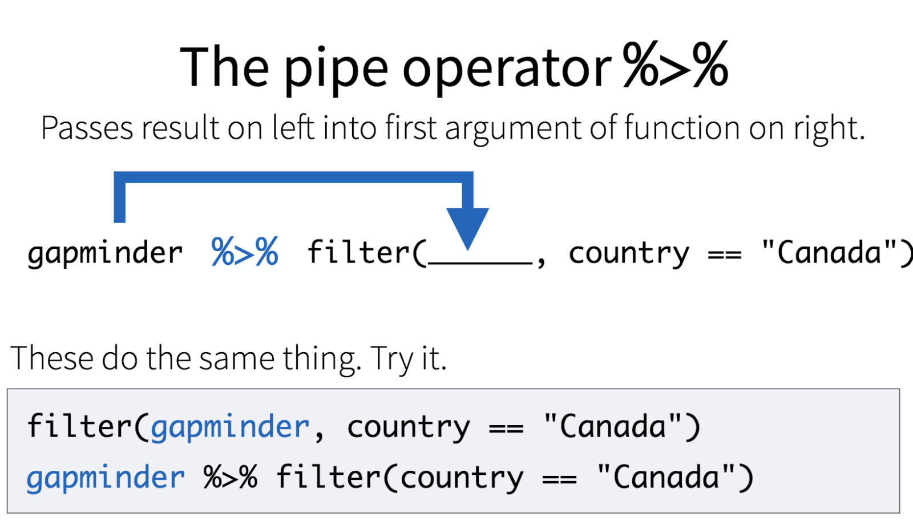

# Week 10
This week, we're diving into data analysis in R. 

---

### Lecture

No lecture. All coding!

---

### Hands-on

**1. Getting started**
 
Alright, fire up Terminal or PowerShell. Let's navigate to where you want to save your code, and fire up a Jupyter Notebook:

```
juptyer notebook
```

Let's install and load a couple packages we'll need today.

```
install.packages("tidyverse")
install.packages("gapminder")
```

Installing them doesn't make them available, however. We need to load them.

```
library(tidyverse)
library(gapminder)
```

Let's use some of the commands we learned last week to figure out what `gapminder` is.

```
head(gapminder)
summary(gapminder)
str(gapminder)
```

Let's try a new one

```
arrange(gapminder, pop)
```

Interesting. What does this do?

```
arrange(gapminder, desc(pop))
```


This lesson is adapted from Hadley Wickham's great [Data Science In Tidyverse](https://github.com/hadley/data-science-in-tidyverse/blob/master/slides/02-Transform.pdf) workshop.

**2. How can we work with only the data we want?**

Like, we probably don't want to review the data for every nation at once. How can we ask more focused, targeted questions?




Let's try it out.

```
filter(gapminder, country == "United States")
```

What do these do.

```
filter(gapminder, continent == "Americas")
filter(gapminder, year > 1980)
filter(gapminder, pop > 20000000 & pop < 100000000)
filter(gapminder, pop > 20000000 & continent == "Americas" & gdpPercap <= 4000)
filter(gapminder, pop > 20000000 & continent != "Americas" & gdpPercap <= 4000)

```

How would you look filer for countries in Asia with high life expectancies?

**3. Arrange**

What if we want to see the countries with the highest life expectancies. Or the lowest? That's where *arrange* comes in.




This nifty function reorders data however we tell it to. Try that:

```
arrange(gapminder, lifeExp)
```

You can also arrange from highest to lowest, or in descending order.

```
arrange(gapminder, desc(lifeExp))

```

**5. Piping**

What if you want to do two things at once?

You *could* do this

```
gapminder_2007 <- filter(gapminder, year == 2007)
arrange(gapminder_2007, desc(lifeExp))
```

Or you could save yourself some time and energy, and embrace the pipe: **%>%**

Basically, it transfers the last command you made to the next command.



Let's try that ourselves

```
gapminder %>% filter(country == "Canada")
```

Awesome. But the power really comes in when you use it more than once.

```
gapminder %>%
	filter(year == 2007) %>%
	arrange(desc(lifeExp))
```

You can also use command shift M on a Mac or ctrl shift M on windows to get one.

**6. Mutate**

How can you create a new vector (a.k.a. column) on your data frame? By using *mutate*.

Let's try it out, by looking at our dataframe first:

```
head(gapminder)
```

OK, so to get the GDP, we could do the following:

```
gapminder %>% mutate(gpd = gdpPercap * pop)
```

And what if we wanted to use a pipe to sort it?

```
gapminder %>% mutate(gdp = gdpPercap * pop) %>% arrange(desc(gdp))
```


**8. Charting**

Let's make a quick chart by first using filter.

```
us <- filter(gapminder, country == "United States")
```

We're gonna feed that into **ggplot2**, the tidyverse's beloved package for creating charts.

The syntax of ggplot is a little different, you'll notice it uses plus signs instead of the pipe. Try this out:

```
ggplot(us, aes(x = year, y = lifeExp)) +
 geom_line()
```

And you know what? It's no harder to plot every country at once.

```
ggplot(gapminder, aes(x = year, y = lifeExp), group=country) +
 geom_line()
```

---

### Links

* Hadley Wickham's [great tidyverse tutorials](https://github.com/hadley/data-science-in-tidyverse)

---

### Homework

* **Final Project**: You should be working on drafts of story and graphics, looking for unanswered questions.