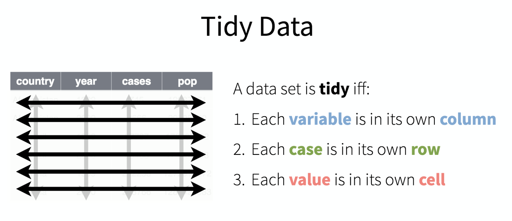

<div class="header">
<h1 class="ml7">
  <span class="text-wrapper">
    <span class="letters"><p id ="usc p">Data&nbsp;&nbsp;Journalism&nbsp;&nbsp;&nbsp;USC&nbsp;&nbsp;2019</p></span>
  </span>
</h1>
</div>
<script src="https://cdnjs.cloudflare.com/ajax/libs/animejs/2.0.2/anime.min.js"></script>

<script src="https://ajax.googleapis.com/ajax/libs/jquery/3.3.1/jquery.min.js"></script>

<style>
.header{
      background-image: linear-gradient(to right, #e66465, #9198e5);
}

.ml7 {
  position: relative;
  font-weight: 1200;


}
.ml7 .text-wrapper {
  position: relative;
  display: inline-block;
  padding-top: 0.2em;
  padding-right: 0.05em;
  padding-bottom: 0.1em;
  overflow: hidden;
  padding-left: 14px;
  
}
.ml7 .letter {
  transform-origin: 0 100%;
  display: inline-block;
  line-height: 1.3em;
  font-size: 3.6em;
  color: #FFFFFF
}


</style>


<script>
// Wrap every letter in a span
$('.ml7 .letters').each(function(){
  $(this).html($(this).text().replace(/([^\x00-\x80]|\w)/g, "<span class='letter'>$&</span>"));
});

anime.timeline({loop: true})
  .add({
    targets: '.ml7 .letter',
    translateY: ["1.1em", 0],
    translateX: ["0.55em", 0],
    translateZ: 0,
    rotateZ: [180, 0],
    duration: 1050,
    easing: "easeOutExpo",
    delay: function(el, i) {
      return 50 * i;
    }
  }).add({
    targets: '.ml7',
    opacity: 0,
    duration: 1000,
    easing: "easeOutExpo",
    delay: 1000
  });
</script>


# Week 13
This week, we're talking about the importance of **tidy** data ... and how to make your data tidy.

---

### Lecture

[Slides](https://docs.google.com/presentation/d/1SlCA6neTiBd6G7ZVfJohozj0AYrhkDS_Nz_ttENfvNM/edit#slide=id.p)

---

### Hands-on

We're going to be learning about tidy data from the creator of the tidyverse, Hadley Wickham. This tutorial is adapted from his [Data Science in the Tidyverse](https://github.com/hadley/data-science-in-tidyverse/tree/master/slides) workshop.

Begin by firing up your Jupyter Notebook. Load the tidyverse library

```
library(tidyverse)
```

**1. So what's tidy data?**



It's easy to work with. For example, you can quickly calculate a per capita rate if you already have the population data right there.

Here are the main functions we'll be working with.


**2. Let's look at some untidy data**

Add a dataset manually.

```
cases <- tribble(
  ~Country, ~"2011", ~"2012", ~"2013",
      "FR",    7000,    6900,    7000,
      "DE",    5800,    6000,    6200,
      "US",   15000,   14000,   13000
)
```
Take a look. What are our variables?

```
head(cases)
```

* Country
* Year
* Count

Take out a piece of paper and draw what it would look like if we rearranged our data so it had three columns: country, year, n

**3. Gather**

Let's parse this

And then run it oursevles.


```
cases %>% gather(key = "year", value = "n", 2:4)
```
Neat! Now we've got something we could chart. Try this.

```
cases %>% gather(key = "year", value = "n", 2:4) %>% ggplot(aes(x= year, y=n, group=Country, color=Country)) + geom_line(lwd=3)
```

**4. Spread**

Let's use some new data.

```
pollution <- tribble(
       ~city,   ~size, ~amount,
  "New York", "large",      23,
  "New York", "small",      14,
    "London", "large",      22,
    "London", "small",      16,
   "Beijing", "large",     121,
   "Beijing", "small",     56
)

head(pollution)
```

The second column is *particle size*. What if we wanted to add together the particle counts for each city?

Right now, we can't.

But ... if 'large' and 'small' were their own columns, then we could. What would our dataset look like if the three columns were city, large, and small.

Draw it out on your piece of paper.

To make that happen, we need `spread`.


```
pollution %>% spread(size, amount)
```

Nice. Now we can create the total particle count for each city.

```
pollution %>% mutate(total = large + small)
```

Or the percent of particles that are large. How would we do that?

If we have any extra time, let's do Final Project updates.


---

### Homework

* [Go to this page and register for a Census API Key](https://api.census.gov/data/key_signup.html)