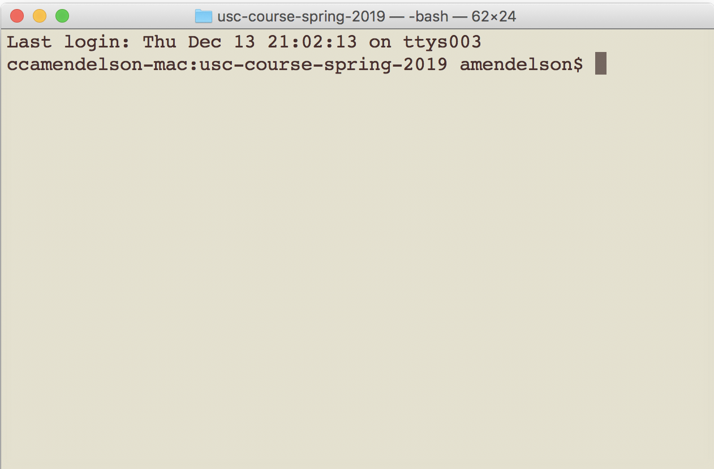

# Week 9
This week, we are going to take some big steps in our coding journey.

---

### Lecture

[Slides](https://docs.google.com/presentation/d/1Gg1DM3Q1OT5QFbs8Q4Pes57PqbwqdObb8-p58ph7pKg/edit#slide=id.p)

---

### Hands-on

**0. The pre-reqs**

You've already installed R, Miniconda and created your Github account.

**1. Let's code**

Anytime you see something that looks like `this`, or that looks like

```
this
```

...that's code. These course webpages are tutorials we're going to go through.

**2. Taking the terminal for a spin**

Alright, open up your **terminal**. On Windows, this may be called **PowerShell**.

It make take a sec to boot up. You should see something like this



That dollar sign is important. After the dollar sign, we'll put the code in many examples (like what we're about to do). Try this out:

```
$ ls
```

Now this:

```
$ open .
```

Let's navigate to somewhere you keep code. If I want to keep it on a folder on my desktop called 'code', here's how I'd do that:

```
$ cd ~/Desktop/code/
```

Now try ```ls``` again.

**3. Setting up our notebook**

OK, now we want to get our notebook up and running. But there's a catch.

R, our programming language of choice, doesn't come pre-installed on Jupyter notebooks.

So let's install it. In the terminal, do this:

```
$ R
```

If you have R installed, you've opened it up. (Notice the dollar sign is gone.) Now run this:

```
install.packages(c('repr', 'IRdisplay', 'evaluate', 'crayon', 'pbdZMQ', 'devtools', 'uuid', 'digest'))
 
```

You'll have to pick a 'mirror' to install them.

Now, let's install one more package, with the following code:

```
devtools::install_github('IRkernel/IRkernel')
```

Getting close. We need to run this to make the package available:

```
IRkernel::installspec(user = FALSE)
```

**4. Opening up the notebook**

Alright, time to open up that notebook. Open a new window or tab in your terminal, just like you would on a web browser. Then navigate to a folder where you keep your code (like we did above).

And type in:

```
jupyter notebook
```

---

### Links

---

### Homework

